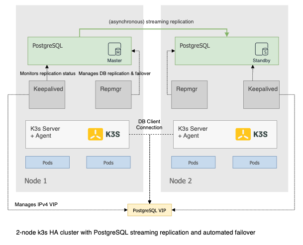

This is an Ansible playbook for setting up a 2-node, high available [k3s](https://github.com/rancher/k3s) cluster using an embedded replicated database. Note that this playbook is experimental and intended as a proof of concept only.

## Motivation

Many use cases involving Kubernetes outside cloud or datacenter ("edge") have a requirement for high availability as well as for low maintenance and operational effort. Often these use cases require an embedded Kubernetes datastore due to unavailability of an external database service on premises. Additionally, due to physical space or budget constraints, the number of available physical machines per edge location may also often be limited to just 2 with an expectation of the cluster being resilient against failure of a single machine.

## Proposed solution



While etcd or other quorum based replicated datastores provide high guarantees for data consistency they do not provide resiliency against hardware failures in a 2-node cluster.

The solution therefore leverages `PostgreSQL`'s streaming replication feature to replicate the Kubernetes data across 2 nodes with the primary node handling all the database read/writes. In a failure scenario, e.g. a completee node failure, an automated failover is executed by the `repmgr` daemon promoting the secondary node to become the new primary.

`Keepalived` is used both to transparently failover the DB client (in this case the k3s servers) traffic to the new primary node as well as to fence-off the previously failed primary node to prevent split-brain.

`k3s` is configured on both nodes in master (server) mode and uses the `VRRP VIP` provided by Keepalived as it's endpoint to the PostgreSQL datastore. The same VIP address can also be used as high available endpoint to access the Kubernetes API.

It's important to note that by using PostgreSQL replication across 2 nodes without the pseudo-quorum provided by a third witness node this setup is quite susceptible to data inconsistency and split-brain.
It may be argued though that for many edge use cases the advantage of achieving hardware fault tolerance by adding a single additional node outweighs this disadvantages.    Specifically, these use cases often are characterized by having:    

- comparable low deployment/upgrade frequency reducing the risk of data loss during a failover.
- the 2 compute devices typically physically co-located and connected directly via a local switch making split-brain as result of network partitioning unlikely.

### Installation

Note: This playbook was only tested on VMs with Debian 13 running on Proxmox VE. It will not work in most public cloud environments that don't support VRRP and Gratuitous ARP in their network.

#### Prerequisites

1. Prepare two VMs or physical machines satisfying the k3s hardware requirements.
2. Provision your SSH key to the machines such that it is authorized for the `ubuntu` user
3. Install Ansible on your local machine.
4. On the nodes, install python3-psyopc2

#### Deployment

1. Update the `hosts` file so that `ansible_host` and `private_ip` variables matches the IPs of the two machines. `ansible_host` is used to provision and `private_ip` is used to setup Keepalived and streaming replication.
2. Update the `vars.yaml` file so that `keepalived_virtual_ip` is set to an IP address in a network segment to which both machines are directly connected to and `keepalived_vrrp_iface` contains the name of the network interface via which the `keepalived_virtual_ip` is routed.
3. Run the Ansible playbook:
	```sh
		ansible-playbook -i hosts --extra-vars="@vars.yml" main.yml
	```

### Run some tests

Here are some tests to verify the HA capabilities of the system.

#### Kubernetes datastore should be resilient to node failure

First, create a K8s deployment by running following commands on one of the nodes:

```sh
sudo kubectl create deployment --image nginx nginx
sudo kubectl scale deployment/nginx --replicas 4
```sh

Then, on the primary node (see the `hosts` file where `psql_master=True`) stop the PostgreSQL service:

```sh
sudo systemctl stop postgresql

```

On the previously secondary node, check the replication status to confirm that a failover occurred after 20-30 seconds and this node is now handling DB read/writes.

```sh
sudo -u postgres repmgr -f /etc/repmgrd.conf cluster show
```

#### DB primary failover should be transparent to k3s control plane

Check that the VIP address has been moved to the new primary node:

```sh
ip addr show dev <vrrp-interface>
```

Check that Kubernetes API server is still functioning on the node with the failed PostgreSQL instance (thanks to the VIP migration):

```
sudo kubectl get pods -o wide

```

#### Split-brain should be prevented when previously failed node recovers


Restart the PostgreSQL service on the previous primary node:

```sh
sudo systemctl start postgresql

```

Confirm that this node is not part anymore of the replication cluster since it doesn't follow the new primary.


```sh
sudo -u postgres repmgr -f /etc/repmgrd.conf cluster show
```

Verify that this PostgreSQL instance has been fenced off (using the VRRP VIP), thus preventing the local k3s master from using it as a datastore.

On the new primary node run:

```sh
sudo kubectl scale deployment/nginx --replicas 5
```

On the previous primary confirm that it's working off of the same API datastore:

```sh
sudo kubectl get deployment/nginx
```

#### User workloads should be migrated to healthy node in case of node failure

On the previous primary confirm that some Nginx pods are running on it:

```sh
sudo kubectl get pods -o wide
```

Shutdown the node or stop the k3s service:

```sh
sudo systemctl stop k3s
```

On the healthy node wait until other node status changes to unreachable.

```sh
sudo kubectl get nodes
```

Wait another 5 minutes (the default toleration gracetime for the `node-unreachable` taint) and confirm that all pods have been migrated to the healthy node.

```sh
sudo kubectl get pods -o wide
```
